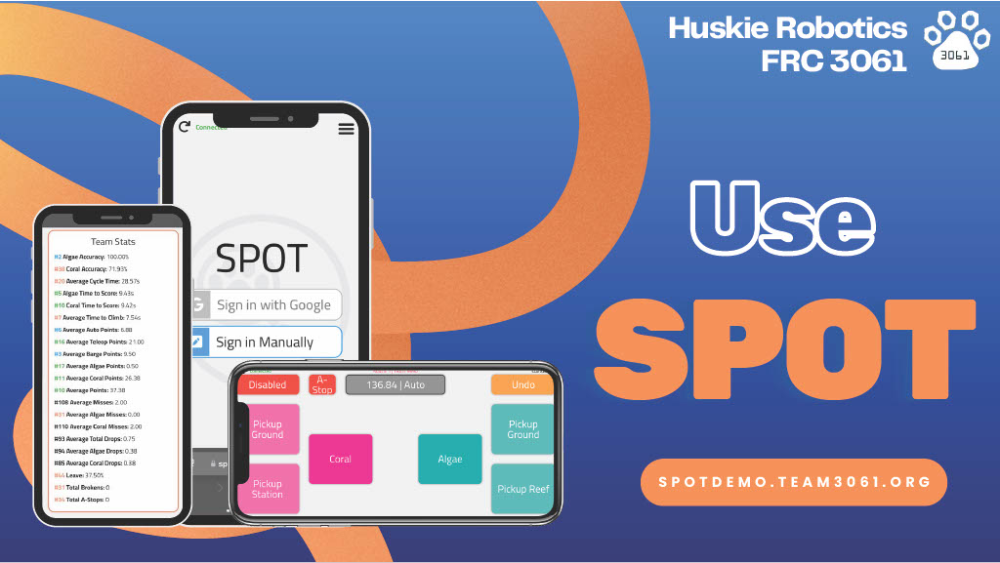

  

# SPOT - Scouting Platforms On Time

SPOT is an open-source modular scouting app framework for FRC developed by Team 3061 Huskie Robotics. SPOT provides a simple platform upon which a team can build a scouting app with little to no prior experience.

## Database Migration (SPOT v4 -> v5)

The database schema for SPOT v5 and later is incompatible with SPOT v4 and earlier. If you don't have data from SPOT v4 or earlier, no migration is required. If you are creating a new database to use with SPOT v5 or later, which is recommended for a new FRC season, no migration is required. If you have data from SPOT v4 or earlier and you want to access it with SPOT v5 or later, migration is required. Refer to the [migration guide](https://docs.google.com/document/d/e/2PACX-1vT-4zxXgeCIOai_fIJwoPhzDs3wWO5fdo-dLJVkPmhtUIvn2NyJjXRBU67fSyDcoUWjL9kp-1UMtNiB/pub) for more information.

## Features

- An easy-to-use platform for data entry throughout matches.
- Works on all platforms, from iOS to Android to the web.
- An analysis page to display detailed statistics and charts about matches and teams.
- Admin view for live scouter management at competition.
- Admins can monitor and verify incoming scouting data to ensure accuracy and consistency throughout the event.
- Preconfigured for the 2025 REEFSCAPE game with no additional game-specific customization required.
- Easy deployment experience when teams run a server on Glitch.
- Optimized for teams who have internet access while scouting but also completely functional for teams with no internet access. [(workflow found here)](https://docs.google.com/document/d/e/2PACX-1vRVXPGirIs_T6EMiAWL_YhG9LXGgbZCH3n0iP5phAYMcYILqNsBTYlxgWW7vkJHRQtXqWpTP7Uwcyo8/pub).
- Quick setup with a built-in first-run wizard to walk teams through configuring their scouting app, connecting to The Blue Alliance or FRC API, and setting up their database.
- Completely configurable analysis and scouting view without the need for a single line of code.
- Easy data deletion

SPOT is built with HTML, JS, CSS, and Node.js and operates with a MongoDB database.

### SPOT is designed for a wide range of teams with a wide range of expertise and requirements:

1. A team that is new to scouting and isn't sure what information to gather or how to analyze their data. SPOT comes as a preconfigured app that can be deployed with minimal setup and will provide all the basic functionality needed by most teams.
2. A team that has some experience with scouting and wants to collect specific data that may not be part of the default configuration but that doesn't have significant programming experience. SPOT can be configured by modifying configuration files rather than by writing code.
3. A team that has experience with scouting and wants to perform custom analysis operations or advanced custom scouting interfaces and has some programming experience. SPOT can utilize user-provided analysis modules to extend its functionality beyond the default configuration without requiring teams to modify the base code.
4. A team that has significant experience with scouting and significant programming expertise. SPOT is open source, documented, and designed to extensible such that teams can start from this code base and build their own custom scouting system.

## Guiding Principles

- SPOT's goal is to provide a universal scouting app platform that can function with any past or future FIRST Robotics game by just changing the configuration.
- SPOT does not require you to write code to configure, set up, or use SPOT.
- SPOT does not require you to be online for its most basic features (scouting, data analysis)

## Getting Started

These instructions will get you a copy of the project up and running on your local machine for development and testing purposes, as well as deployed on a server (Glitch or Amazon Web Services). If you have any questions, feel free to contact us [spot@team3061.org](mailto:spot@team3061.org).

### [Quickstart](https://docs.google.com/document/d/e/2PACX-1vQyMGqxn7CdAM1srgcaQKJGnJawiVCH-nxSbhq_hm0jYA9e2-axnV-mmqxOveJp5lX3TMohQieNe1Ft/pub)

## Usage

This is a guide on how to use SPOT as well as its features, with a text and a video walkthrough.

### [Usage Guide](https://docs.google.com/document/d/e/2PACX-1vTwLwWJwcn1WdrNSZLGY33f04TjXjwypreY7mTkSBck8K20i9injrl6MUOrHQLrpy9u8UvQu99XHLge/pub)

## Configuration

This is a guide to configuring SPOT. You can configure the buttons displayed in the scouting view as well as how data is transformed and displayed.

### [Configuration Guide](https://docs.google.com/document/d/e/2PACX-1vRL0EauWWVXWEu9jQJ37-8SI6dSUrGMm6z2wrqwH6HYOA8FarEFugxXrZluRrI_Tpy92qqM9rypbhgr/pub)

## Contributing

Please read [CONTRIBUTING.md](CONTRIBUTING.md) for details on contributing to SPOT.

## Documentation

Documentation of the core codebase is currently partially included in files. Check back soon for in-depth documentation later!

## Authors

- **Dylan Schmit** - _Initial work_ - [cyandev](https://github.com/cyandev)
- **Nithilan Kalidoss** - _Initial work_ - [nithilan4](https://github.com/nithilan4)

See also the list of [contributors](https://github.com/HuskieRobotics/SPOT/contributors) who participated in this project.

## License

This project is licensed under the Apache License 2.0 - see the [LICENSE.md](LICENSE) file for details
