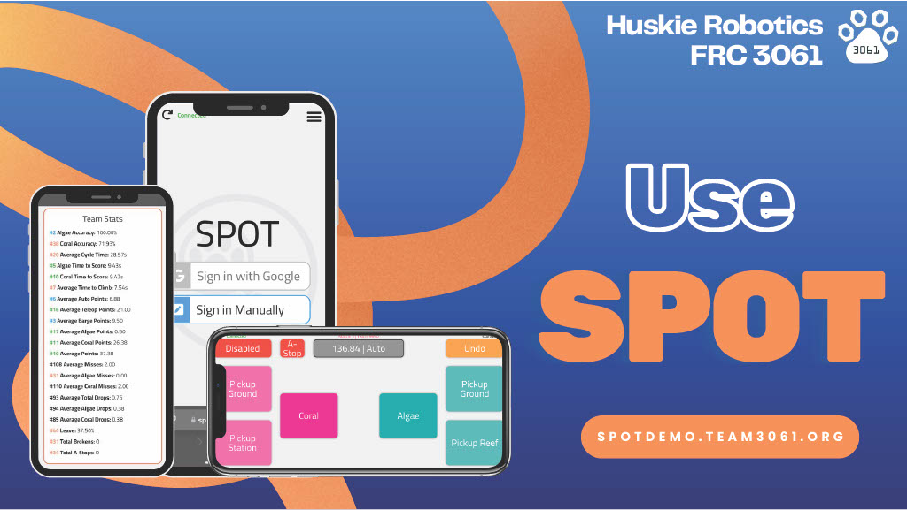

<div align="center">
  
</div>

# SPOT — Scouting Platforms On Time (v6, in development)

SPOT is an open-source, configuration-driven match-scouting platform for FRC, developed by
Team 3061 Huskie Robotics. **This branch is the v6 rewrite** (Next.js, Tailwind/shadcn,
MongoDB). It is not yet usable at events.

- The current production app (v5, Express/EJS) is on `main` until cutover and on the `v5`
  branch afterwards. Its documentation links are in that branch's README.
- The full requirements specification for the rewrite is in [`docs/spec/`](docs/spec/README.md).
- The legacy behavioral oracle (golden analysis output for 2025 and 2026 real data) is in
  [`tools/oracle/`](tools/oracle/README.md).
- Legacy v1 configuration files (2022–2026) are in [`config/v1/`](config/v1/README.md).

## Status

Phase 0 (preparation) — see `docs/spec/17-rewrite-plan-and-next-steps.md`. This scaffold
provides the app skeleton, test tooling, and CI so that every later pull
request is verified automatically (`docs/spec/02-architecture.md`, NF-8).

## Getting started (developers)

```sh
node -v            # Node 24 (see .nvmrc)
npm ci
cp .env.example .env.local   # fill in values
npm run dev        # http://localhost:3000
```

Quality gates: `npm run lint`, `npm run typecheck`, `npm test`, `npm run build`,
`npm run test:e2e` (Playwright, Chromium).

## Deployment targets

AWS EC2 (Team 3061) and Google Cloud (other teams). Recipes live under `deploy/`; the app is
cloud-neutral and runs as plain Node (`npm run build && npm start`), no Docker required.

## Contributing

See `.github/CONTRIBUTING.md`, `CODE_OF_CONDUCT.md`, and `CLAUDE.md` (working rules,
including citing requirement ids in pull requests). License: Apache 2.0.
